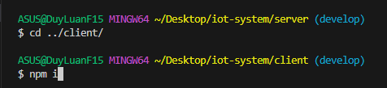
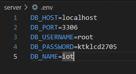
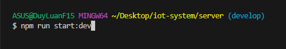
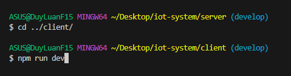
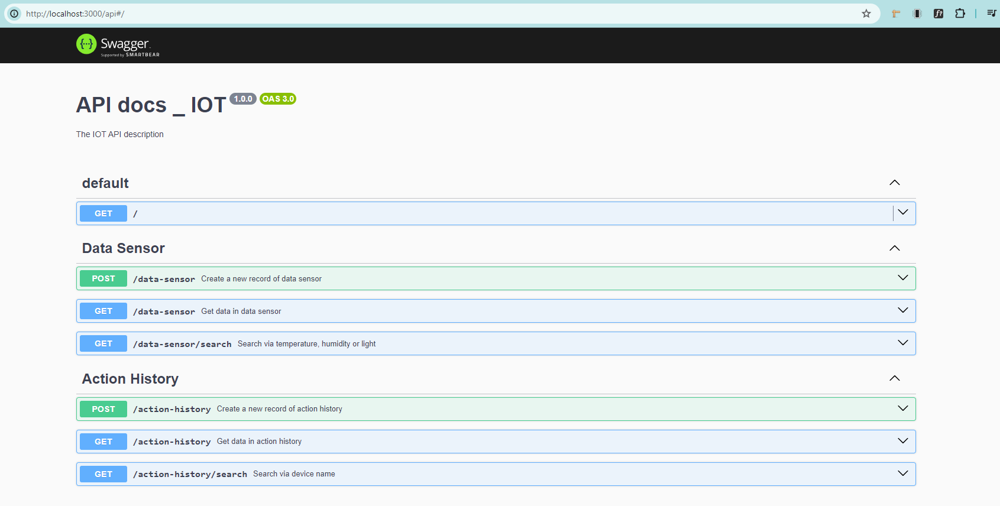

## 1. Overview:

- Hệ thống IoT web application sử dụng ESP8266 để lưu trữ dữ liệu nhiệt độ, độ ẩm, ánh sáng và bật/tắt đèn/quạt.

- Luồng hoạt động:

* Hiển thị dữ liệu:
  Hardware kết nối với Server (NestJS) thông qua MQTT broker--> Dữ liệu từ hardware sẽ được Server lưu vào database (MySQL). Server cung cấp các API cho Client (NextJS) để hiển thị dữ liệu cho người dùng.

* Bật/Tắt đèn/quạt:
  <Đang phát triển>

## 2. Setup:

- Step 1: Vào link sau và clone dự án về máy:

  `https://github.dev/luanphungduy/iot-system`

- Step 2: Cài đặt các dependencies và config lại database.

  Trỏ đến thư mục server và gõ `npm i` để cài đặt các dependencies cần thiết

  

  Làm tương tự với thư mục client

  

  Vào file .env ở server và sửa lại cho khớp username, password và tên database ở local.

  

- Step 3: Kết nối laptop với mạch:

  Mạch bao gồm: NodeMCU ESP8266, cảm biến nhiệt độ độ ẩm DHT11, 2 đèn LED, 1 quang trở, 1 biến trở (hoặc nhiều hơn), dây để nạp code và lấy nguồn điện từ máy tính, một số dây để lắp mạch.

- Step 4: Chạy song song server và client:
  Tại đường dẫn đến thư mục server, gõ `npm run start:dev` để chạy server

  

  Sau đó `cd ../client` để trỏ đến đường dẫn client, gõ `npm run dev` để chạy client

  

  Truy cập `http://localhost:3000/api/` để xem apidocs

  

## 3. Tài liệu và tham khảo

- Tài liệu NextJS tại: `https://nextjs.org/docs`
- Tài liệu NestJS tại: `https://docs.nestjs.com`
- Tải Mqtt tại: `https://mosquitto.org/download`
- Hướng dẫn cài MQTT broker: `https://www.youtube.com/watch?v=xLLFrLhegcw`
- Kiến thức về hardware: `https://youtu.be/qdxKUQEgDNE?si=jq4B2je0GqNbf6Yp`
- Tích hợp username, password cho MQTT broker: `https://www.youtube.com/watch?v=fknowuQJ9MA`
